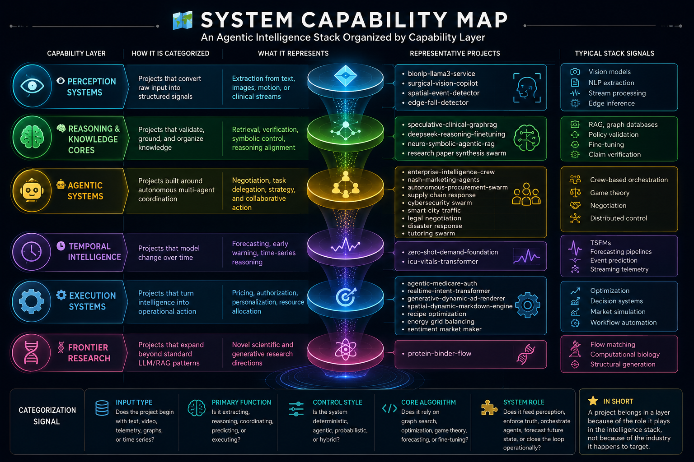

<h1 align="center">Hi, I'm Arash — Agentic AI & LLM Engineer</h1>

  Building multi-agent systems, clinical LLM pipelines, and neuro-symbolic AI infrastructure.
  <a href="https://aragit.github.io/#home">Portfolio →</a>

---

## 🧠 System Overview

This is not a simple project list.

It is a **composable intelligence stack** — a portfolio of systems that transform raw signals into structured reasoning, coordinated action, prediction, and real-world impact.

> The future of AI is not better prompts.  
> It is better systems.

---

## 🔭 Currently Building

- **[Agentic CBT System](#-agentic-systems--orchestration--autonomy)** — multi-agent architecture for autonomous cognitive behavioral therapy delivery
- **[Nash Marketing Agents](#-agentic-systems--orchestration--autonomy)** — game-theoretic equilibrium engine for competitive ad-bidding simulations
- **[Zero-Shot Demand Forecasting](#-temporal-intelligence--prediction--foresight)** — supply-chain telemetry with zero-shot time-series foundation models
- **[Neuro-Symbolic Agentic RAG](#-reasoning--knowledge-cores--validation-truth-control)** — deterministic multi-agent clinical core

---

## 🗺️ System Capability Map

This portfolio is organized by **capability layer** rather than by domain.  
The goal is to show how each project contributes to a larger agentic intelligence stack: perception → reasoning → orchestration → prediction → execution → frontier research.

  

| Capability Layer | How It Is Categorized | What It Represents | Representative Projects | Typical Stack Signals |
|---|---|---|---|---|
| **👁️ Perception Systems** | Projects that convert raw input into structured signals | Extraction from text, images, motion, or clinical streams | `bionlp-llama3-service`, `surgical-vision-copilot`, `spatial-event-detector`, `edge-fall-detector` | Vision models, NLP extraction, stream processing, edge inference |
| **🧠 Reasoning & Knowledge Cores** | Projects that validate, ground, and organize knowledge | Retrieval, verification, symbolic control, reasoning alignment | `speculative-clinical-graphrag`, `deepseek-reasoning-finetuning`, `neuro-symbolic-agentic-rag`, research paper synthesis swarm | RAG, graph databases, policy validation, fine-tuning, claim verification |
| **🤖 Agentic Systems** | Projects built around autonomous multi-agent coordination | Negotiation, task delegation, strategy, and collaborative action | `enterprise-intelligence-crew`, `nash-marketing-agents`, `autonomous-procurement-swarm`, supply chain response, cybersecurity swarm, smart city traffic, legal negotiation, disaster response, tutoring swarm | Crew-based orchestration, game theory, negotiation, distributed control |
| **⏱️ Temporal Intelligence** | Projects that model change over time | Forecasting, early warning, time-series reasoning | `zero-shot-demand-foundation`, `icu-vitals-transformer` | TSFMs, forecasting pipelines, event prediction, streaming telemetry |
| **⚙️ Execution Systems** | Projects that turn intelligence into operational action | Pricing, authorization, personalization, resource allocation | `agentic-medicare-auth`, `realtime-intent-transformer`, `generative-dynamic-ad-renderer`, `spatial-dynamic-markdown-engine`, recipe optimization, energy grid balancing, sentiment market maker | Optimization, decision systems, market simulation, workflow automation |
| **🧬 Frontier Research** | Projects that expand beyond standard LLM/RAG patterns | Novel scientific and generative research directions | `protein-binder-flow` | Flow matching, computational biology, structural generation |

| Categorization Signal | What We Look For |
|---|---|
| **Input type** | Does the project begin with text, video, telemetry, graphs, or time series? |
| **Primary function** | Is it extracting, reasoning, coordinating, predicting, or executing? |
| **Control style** | Is the system deterministic, agentic, probabilistic, or hybrid? |
| **Core algorithm** | Does it rely on graph search, optimization, game theory, forecasting, or fine-tuning? |
| **System role** | Does it feed perception, enforce truth, orchestrate agents, forecast future state, or close the loop operationally? |

**In short:**  
a project belongs here because of the **role it plays in the intelligence stack**, not because of the industry it happens to target.

---

## 👁️ Perception Systems — Structure Extraction from the Real World

Systems that convert unstructured text, images, motion, and clinical streams into machine-readable representations.

### 🔹 [BioNLP LLaMA3 Service](https://github.com/aragit/bionlp-llama3-service/tree/main)

**Clinical entity extraction from unstructured EHR pipelines**

- **Stack:** LLaMA-3-8B, Unsloth, PEFT/LoRA, FastAPI
- **Core idea:** memory-efficient fine-tuning for multi-token biomedical NER
- **Role in system:** perception layer for structured clinical understanding

<b>Architecture insight</b>

- Extracts biomarkers and clinical terms from messy text
- Optimized for low-memory fine-tuning and fast inference
- Designed to feed downstream retrieval and reasoning layers

### 🔹 [Surgical Vision Copilot](mailto:anicomanesh@gmail.com?subject=Access%20Request%3A%20surgical-vision-copilot)

**Real-time surgical understanding with vision-language models**

- **Stack:** PyTorch, Video-LLaVA, OpenCV, temporal action localization
- **Core idea:** tracks procedural steps and predicts the next needed tool
- **Status:** private / request access
- **Role in system:** visual perception layer for clinical action understanding

<b>Architecture insight</b>

- Encodes streaming video into temporal event sequences
- Adds action understanding on top of raw frame perception
- Built to support assistive decision loops in time-sensitive environments

### 🔹 [Spatial Event Detector](https://github.com/aragit/spatial-event-detector)

**Real-time kinematic telemetry engine**

- **Stack:** PyTorch, YOLOv11-Pose, OpenCV, NumPy
- **Core idea:** converts raw pose estimation into deterministic movement states
- **Role in system:** motion-to-symbol pipeline for edge intelligence

<b>Architecture insight</b>

- Separates pixel ingestion from logical inference
- Computes joint vectors over temporal windows
- Uses a state machine to detect meaningful spatial events

### 🔹 [Edge Fall Detector](https://github.com/aragit/edge-fall-detector)

**Real-time patient fall detection on NVIDIA Jetson**

- **Stack:** YOLOv11-Pose, TensorRT, Jetson Orin, MQTT, OpenCV
- **Core idea:** on-device fall detection with privacy-preserving inference
- **Role in system:** edge perception layer for clinical safety monitoring

<b>Architecture insight</b>

- Converts pose estimation into TensorRT-optimized inference
- Supports local processing for privacy and low latency
- Designed for continuous monitoring in constrained environments

## 🧠 Reasoning & Knowledge Cores — Validation, Truth Control, and Retrieval

Systems that turn perception into structured reasoning, grounded answers, and verifiable decisions.

### 🔹 [Speculative Graph RAG](https://github.com/aragit/speculative-clinical-graphrag)

**Self-correcting clinical knowledge core**

- **Stack:** LlamaIndex, Neo4j, vLLM, DeepSeek-R1
- **Core idea:** graph-based retrieval with a verification layer for clinical facts
- **Role in system:** reasoning core for grounded medical intelligence

<b>Architecture insight</b>

- Combines dense graph retrieval with structured verification
- Validates extracted pathways against medical taxonomies
- Designed to reduce hallucination and improve traceability

### 🔹 [DeepSeek Reasoning Fine-Tuning](https://github.com/aragit/deepseek-reasoning-finetuning)

**Medical CoT LoRA alignment pipeline**

- **Stack:** Unsloth, PyTorch, Hugging Face, TRL
- **Core idea:** parameter-efficient reasoning alignment with 4-bit quantization
- **Role in system:** reasoning optimization layer for chain-of-thought behavior

<b>Architecture insight</b>

- Fine-tunes reasoning behavior efficiently under memory constraints
- Maps diagnostic thought chains into model behavior
- Useful for improving structured response quality in expert workflows

### 🔹 [Neuro-Symbolic Agentic RAG](mailto:anicomanesh@gmail.com?subject=Access%20Request%3A%20neuro-symbolic-agentic-rag)

**Deterministic multi-agent clinical core**

- **Stack:** request access
- **Core idea:** cyclic planning and execution with policy validation
- **Status:** private / request access
- **Role in system:** control plane for safe clinical reasoning

<b>Architecture insight</b>

- Coordinates single- and multi-agent graphs
- Adds an Open Policy Agent validation ring
- Designed for deterministic workflows where correctness matters

### 🔹 [Agentic Research Paper Review & Synthesis Swarm](#)

**Swarm of agents that ingests papers, verifies claims, and synthesizes literature reviews**

- **Stack:** PDF parsing, ArXiv API, claim extraction, contradiction detection, graph synthesis
- **Core idea:** identifies hypotheses, validates findings, and resolves conflicting evidence
- **Status:** concept / not yet implemented
- **Role in system:** research reasoning layer for scientific synthesis

<b>Architecture insight</b>

- Ingestion agent extracts paper sections and structure
- Verification agent cross-references claims against citations
- Conflict detection agent flags contradictions across sources
- Synthesis agent generates reviews and identifies research gaps

## 🤖 Agentic Systems — Orchestration & Autonomy

Systems that coordinate multiple agents, strategies, and tools to act in dynamic environments.

### 🔹 [Enterprise Intelligence Crew](https://github.com/aragit/enterprise-intelligence-crew/tree/main)

**Autonomous content lifecycle platform**

- **Stack:** CrewAI, LangChain, Pydantic, ChromaDB
- **Core idea:** hierarchical multi-agent workflow with strict schema validation
- **Role in system:** orchestration layer for collaborative agent execution

<b>Architecture insight</b>

- Includes specialized agents for trend investigation, risk analysis, and copywriting
- Uses memory syncs and delegation constraints
- Enforces structured outputs through Pydantic containers

### 🔹 [Nash Marketing Agents](https://github.com/aragit/agentic-nash-marketing)

**Multi-agent competitive market simulation engine**

- **Stack:** NumPy, SciPy, SQLite/PostgreSQL, FastAPI, Pydantic, SQLAlchemy, Docker, pytest
- **Core idea:** models non-cooperative ad-bidding using mixed-strategy Nash equilibria
- **Role in system:** decision-making layer for strategic competition

<b>Architecture insight</b>

- Simulates autonomous brand agents under resource constraints
- Helps prevent budget-depletion loops in bidding environments
- Useful for strategic experimentation before production deployment

### 🔹 [Autonomous Procurement Swarm](https://github.com/aragit/autonomous-procurement-swarm)

**Multi-agent contract negotiation swarm**

- **Stack:** Ray/RLlib, CrewAI, vLLM, Python
- **Core idea:** buyer and seller agents negotiate procurement contracts autonomously
- **Role in system:** decentralized negotiation layer for constrained environments

<b>Architecture insight</b>

- Simulates market pricing, inventory constraints, and geopolitical risk
- Designed for collaborative yet adversarial agent behavior
- Shows how autonomy can be applied to real business operations

### 🔹 [Agentic Supply Chain Disruption Response](#)

**Multi-agent supply chain disruption simulator**

- **Stack:** multi-agent orchestration, graph routing, local LLM negotiation, optimization
- **Core idea:** suppliers, warehouses, and retailers autonomously re-plan when disruptions hit
- **Status:** concept / not yet implemented
- **Role in system:** coordination layer for logistics under uncertainty

<b>Architecture insight</b>

- Orchestrator detects disruptions and triggers re-planning
- Supplier agents manage inventory, pricing, and capacity
- Logistics agent computes alternative routes with graph algorithms
- Retailer agents negotiate orders and demand shifts

### 🔹 [Agentic Cybersecurity Threat Hunting Swarm](#)

**Autonomous SOC swarm for anomaly detection and response**

- **Stack:** synthetic network telemetry, log correlation, state machine workflows, local LLM reasoning
- **Core idea:** scouts detect anomalies, correlation agents link them, response agents isolate threats
- **Status:** concept / not yet implemented
- **Role in system:** defensive autonomy layer for security operations

<b>Architecture insight</b>

- Implements alert → triage → contain → eradicate → recover flow
- Forensics agent reconstructs attack chains post-incident
- Designed around incident-response realism and testability

### 🔹 [Agentic Smart City Traffic Optimization](#)

**Multi-agent traffic signal and routing optimizer**

- **Stack:** graph road network, city simulation, intersection agents, routing optimization
- **Core idea:** traffic lights, transit, and emergency routing negotiate in real time
- **Status:** concept / not yet implemented
- **Role in system:** urban autonomy layer for city-scale coordination

<b>Architecture insight</b>

- Intersection agents negotiate green-light durations
- Transit agent balances passenger load and schedules
- Emergency agent overrides for ambulances and fire trucks
- City orchestrator resolves global conflicts and deadlocks

### 🔹 [Agentic Legal Contract Negotiation Engine](#)

**Autonomous contract negotiation system for legal agreements**

- **Stack:** Pareto frontier computation, Nash bargaining, clause generation, risk analysis
- **Core idea:** legal agents negotiate terms and identify risks for both parties
- **Status:** concept / not yet implemented
- **Role in system:** negotiation layer for formal agreements

<b>Architecture insight</b>

- Party agents represent buyer/seller or tenant/landlord sides
- Mediator proposes compromises and detects deadlocks
- Risk analyst flags problematic clauses and hidden tradeoffs

### 🔹 [Agentic Disaster Response Coordination](#)

**Multi-service disaster coordination and rescue prioritization system**

- **Stack:** incident simulation, resource allocation, routing, triage, local LLM strategy generation
- **Core idea:** fire, medical, police, and logistics units coordinate under uncertainty
- **Status:** concept / not yet implemented
- **Role in system:** high-stakes autonomy layer for public safety

<b>Architecture insight</b>

- Incident commander sets global priorities
- Fire, medical, police, and logistics agents coordinate response
- Ethical triage reasoning under scarce resources
- Real-time map dashboard for operational awareness

### 🔹 [Agentic Educational Tutoring Swarm](#)

**Adaptive tutoring system with concept mastery modeling**

- **Stack:** knowledge graph, tutoring agents, adaptive questioning, progress reporting
- **Core idea:** subject agents, pedagogy agent, and motivation agent personalize learning
- **Status:** concept / not yet implemented
- **Role in system:** autonomous education layer for personalized instruction

<b>Architecture insight</b>

- Assessment agent diagnoses knowledge gaps
- Subject agents explain and reinforce concepts
- Pedagogy agent adapts teaching style
- Reporting agent tracks mastery and at-risk students

## ⏱️ Temporal Intelligence — Prediction & Foresight

Systems that model time, anticipate outcomes, and enable proactive decision-making.

### 🔹 [Zero-Shot Demand Foundation](https://github.com/aragit/zero-shot-demand-foundation)

**Predictive supply-chain telemetry pipeline**

- **Stack:** Amazon Chronos-2, Google TimesFM 2.5, Hugging Face
- **Core idea:** zero-shot forecasting with time-series foundation models
- **Role in system:** foresight layer for inventory and demand planning

<b>Architecture insight</b>

- Moves beyond traditional ARIMA/LSTM pipelines
- Uses foundation models for long-context temporal reasoning
- Incorporates exogenous signals for more realistic forecasting

### 🔹 [ICU Vitals Transformer](#)

**Transformer-based ICU vitals forecaster**

- **Stack:** TimesFM 2.5, PatchTST, Redpanda/Kafka, FastAPI, WebSockets
- **Core idea:** predicts critical events from streaming physiological signals
- **Status:** coming soon
- **Role in system:** temporal reasoning layer for patient monitoring

<b>Architecture insight</b>

- Ingests high-frequency vitals from an HL7 FHIR gateway
- Converts streams into forecastable windows
- Intended to support early warning for critical deterioration

## ⚙️ Execution Systems — Closing the Loop in the Real World

Systems that transform inference into measurable business or clinical action.

### 🔹 [Spatial Dynamic Markdown Engine](#)

**Dynamic pricing and liquidation engine**

- **Stack:** TimesFM 2.5, Ray, SciPy, PostgreSQL
- **Core idea:** real-time pricing for seasonal and stagnant inventory
- **Status:** coming soon
- **Role in system:** commercial execution layer for margin protection

<b>Architecture insight</b>

- Adjusts pricing from temporal signals and inventory state
- Designed to reduce margin erosion through faster action
- Bridges forecasting with operational execution

### 🔹 [Agentic Medicare Authorization](mailto:anicomanesh@gmail.com?subject=Access%20Request%3A%20agentic-medicare-auth)

**Agentic prior authorization engine**

- **Stack:** request access
- **Core idea:** maps EHR evidence against CMS guidance to generate authorization forms
- **Status:** private / request access
- **Role in system:** execution layer for healthcare operations

<b>Architecture insight</b>

- Ingests raw EHR data and regulatory documents
- Compiles evidence-backed submissions to reduce denials
- Designed to automate repetitive, high-friction administrative work

### 🔹 [Real-Time Intent Transformer](mailto:anicomanesh@gmail.com?subject=Access%20Request%3A%20realtime-intent-transformer)

**Session-based e-commerce intent telemetry engine**

- **Stack:** request access
- **Core idea:** maps live session behavior to contextual incentives
- **Status:** private / request access
- **Role in system:** agentic decision layer for adaptive commerce

<b>Architecture insight</b>

- Ingests clickstream and cart activity in real time
- Uses dense behavioral stores for session interpretation
- Triggers contextual actions from inferred intent

### 🔹 [Generative Dynamic Ad Renderer](mailto:anicomanesh@gmail.com?subject=Access%20Request%3A%20generative-dynamic-ad-renderer)

**Telemetry-driven ad generation pipeline**

- **Stack:** request access
- **Core idea:** dynamically generates ad scripts from live user telemetry
- **Status:** private / request access
- **Role in system:** execution layer for personalized media generation

<b>Architecture insight</b>

- Converts behavioral signals into creative output
- Connects LLM generation with rendering automation
- Built for adaptive content delivery at runtime

### 🔹 [Agentic Recipe & Nutrition Optimization System](#)

**Personalized meal planning through negotiation between nutrition, taste, budget, and ingredients**

- **Stack:** linear programming, USDA nutrition data, grocery simulation, LLM recipe generation
- **Core idea:** balances nutritional targets with preferences and cost constraints
- **Status:** concept / not yet implemented
- **Role in system:** optimization layer for food-tech decisioning

<b>Architecture insight</b>

- Nutrition agent enforces macro and micro targets
- Preference agent learns taste profiles and substitutions
- Budget agent optimizes cost under ingredient constraints
- Shopping agent navigates dynamic pricing in simulated stores

### 🔹 [Agentic Energy Grid Balancing System](#)

**Smart grid simulation with decentralized energy trading**

- **Stack:** double auction engine, carbon optimization, generation and storage agents, real-time grid control
- **Core idea:** balances supply and demand while minimizing carbon impact
- **Status:** concept / not yet implemented
- **Role in system:** infrastructure execution layer for energy systems

<b>Architecture insight</b>

- Solar and wind agents model variable generation
- Battery agent handles storage arbitrage
- Consumer agents respond to price and demand
- Grid orchestrator stabilizes frequency and balance

### 🔹 [Agentic Sentiment-Driven Market Maker](#)

**Autonomous market-making system driven by sentiment and risk signals**

- **Stack:** order book simulation, sentiment scoring, risk control, regulatory detection
- **Core idea:** adjusts spreads and inventory using news sentiment and market signals
- **Status:** concept / not yet implemented
- **Role in system:** execution layer for algorithmic trading simulation

<b>Architecture insight</b>

- Market makers compete with different risk appetites
- Sentiment agent interprets synthetic news
- Regulatory agent detects spoofing, layering, and wash trading
- Exchange engine handles matching and discovery

## 🧬 Frontier Research — Beyond Conventional AI

Systems that push beyond standard LLM/RAG pipelines into new computational frontiers.

### 🔹 [Protein Binder Flow](https://github.com/aragit/Flow-Matching-Protein-Binder-Generator)

**Flow-matching protein binder generator**

- **Stack:** PyTorch, Biopython, Flow Matching Primitives, FoldSeek
- **Core idea:** structural molecular generation through flow matching
- **Role in system:** research frontier for generative bio-AI

<b>Architecture insight</b>

- Moves beyond diffusion-style generation
- Targets novel protein-ligand binding behavior
- Demonstrates capability expansion into computational biology

## 🛠️ Core Engineering Showcases

### 🔹 [DeepSeek Reasoning Fine-Tuning](https://github.com/aragit/deepseek-reasoning-finetuning)
### 🔹 [BioNLP LLaMA3 Service](https://github.com/aragit/bionlp-llama3-service/tree/main)
### 🔹 [Spatial Event Detector](https://github.com/aragit/spatial-event-detector)
### 🔹 [Edge Fall Detector](https://github.com/aragit/edge-fall-detector)

These projects show the foundation beneath the system: fine-tuning, extraction, perception, and edge deployment.

## 🛒 E-Commerce & MarTech

### 🔹 [Generative Dynamic Ad Renderer](mailto:anicomanesh@gmail.com?subject=Access%20Request%3A%20generative-dynamic-ad-renderer)
### 🔹 [Real-Time Intent Transformer](mailto:anicomanesh@gmail.com?subject=Access%20Request%3A%20realtime-intent-transformer)
### 🔹 [Spatial Dynamic Markdown Engine](#)
### 🔹 [Agentic Sentiment-Driven Market Maker](#)

These projects translate AI into revenue, pricing, conversion, and adaptive customer response.

## ✍️ Recent Articles & Insights

### Agentic AI
- [The Planning-Rubicon: Why the Vast Majority of AI Agents Are Just Expensive Chatbots — Part I](https://medium.com/@anicomanesh/the-planning-rubicon-why-the-vast-majority-of-ai-agents-are-just-expensive-chatbots-part-i-fa0409a10d8e)
- [From Generative to Agentic AI: A Roadmap in 2026](https://medium.com/@anicomanesh/from-generative-to-agentic-ai-a-roadmap-in-2026-8e553b43aeda)
- [Beyond the Hype of Expensive Chatbots: Bridging Strategic Business Intent with Adaptive Agentic Systems](https://medium.com/@anicomanesh/beyond-the-hype-of-expensive-chatbots-bridging-strategic-business-intent-with-adaptive-agentic-d1144e9df041)

### Generative AI and LLM Engineering
- [A Dive into Unsloth & Gemma 3](https://medium.com/@anicomanesh/a-dive-into-unsloth-gemma-3-fine-tune-gemma-3-12b-with-unsloth-trl-for-custommer-service-53e93692d4d6)
- [A Dive Into LLM Output Configuration, Prompt Engineering Techniques and Guardrails Part I](https://medium.com/@anicomanesh/a-dive-into-advanced-prompt-engineering-techniques-for-llms-part-i-23c7b8459d51)
- [Token Efficiency and Compression Techniques in Large Language Models](https://medium.com/@anicomanesh/token-efficiency-and-compression-techniques-in-large-language-models-navigating-context-length-05a61283412b)

<b>📚 See all articles</b>

### Applied Machine Learning
- [First Steps Toward Building an Autonomous Agentic AI for CBT](https://anicomanesh.substack.com/p/first-steps-toward-building-an-autonomous)
- [Model Drift: Identifying and Monitoring for Model Drift](https://anicomanesh.substack.com/p/model-drift-identifying-and-monitoring)
- [Evolution of Recommendation Algorithms, Part I](https://medium.com/@anicomanesh/evolution-of-recommendation-algorithms-part-i-fundamentals-and-classical-recommendation-bb1c0bce78a9)
- [Machine Learning Interpretability (MLI) with XGBoost and SHAP](https://medium.com/@anicomanesh/interpretable-machine-learning-iml-with-xgboost-and-additive-tools-42258fb1f14)
- [Data Leakage: Causes, Effects and Solutions](https://medium.com/@anicomanesh/data-leakage-causes-effects-and-solutions-6cc44a149e1c)

## 🧭 Design Principles

- Systems > Models  
- Agents > Pipelines  
- Reasoning > Generation  
- Constraints > Prompts  
- Architecture > Hacks  

## 🏗️ Vision: Aethron AI

Building next-generation Agentic AI systems that:

- operate autonomously
- reason under constraints
- coordinate as intelligent systems
- integrate into real-world workflows

---

  
  
  
  
  
  
  
  
  
  
  
  
  
  
  
  
  
  
  
  
  
  
  
  
  
  
  
  
  
  
  
  
  
  
  
  
  
  
  
  
  
  
  
  
  
  
  
  
  
  

## 📫 Let's Connect

- LinkedIn: https://linkedin.com/in/arashnicoomanesh
- GitHub: https://github.com/aragit

---

⭐ If you find this interesting, follow my work — I’m building the future of Agentic AI.
