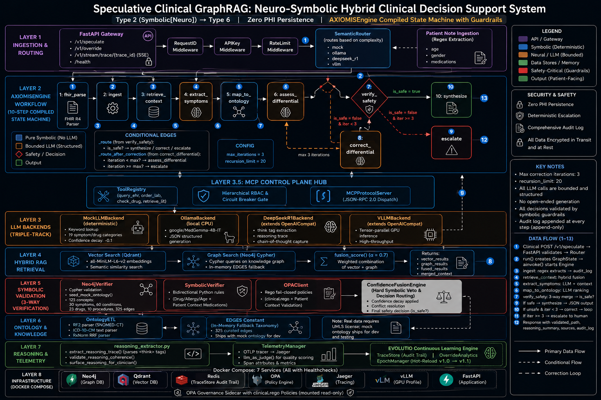

# Arash Nicoomanesh
<b>Agentic AI Architect • LLM Engineer</b>

 

 

  <b>✨ Building Enterprise-Grade, Agentic AI Systems for High-Stakes Domains</b> 

 

<!-- Website Button: Dark background (#0D1117), Dark Orange prompt icon & right icon (#D97706) -->

  

 

<!-- THE COMPOUND ARCHITECT (Theoretical Foundation & System Design) -->
<!-- THE COMPOUND ARCHITECT (Theoretical Foundation & System Design) -->

---

***I design and deploy end-to-end AI architectures that survive in high-liability environments — clinical decisions where a wrong action causes irreversible harm, competitive markets where latency is critical, and enterprise workflows demanding strict data sovereignty. My expertise spans the complete AI engineering lifecycle: fine-tuning localized models, optimizing distributed inference architectures, designing agentic RAG pipelines, and implementing neuro-symbolic architecture. Across every paradigm, the architectural standard remains absolute: systems must be observable, verifiable, and fail-safe.***

 

<h3>🔬 <code>My Current Engineering and Applied Research Focuses</code></h3>

*   **🧠 Neuro-Symbolic Architectures Across High-Stakes Domains**: Architecting pipelines where neural perception is strictly bounded by deterministic logic. Applied patterns include cyclic validation loops for multi-drug optimization (Clinical/Medicare), Nash equilibrium solvers for multi-agent ad auctions (Marketing/Game Theory), and verifiable workflow generation (Scientific Discovery).   
*   **⚡ Test-Time Compute Scaling & Process Supervision**: Architecting "System 2" inference pipelines that dynamically scale test-time compute based on task complexity. Utilizing Process Reward Models (PRMs) and search-based reasoning to enable agents to deliberate, verify, and correct intermediate steps before taking action. 
*   **📡 Statistical Telemetry & Drift Observability**: Building deterministic, FastMCP-native statistical monitoring engines. Translating embedding distribution decay into actionable telemetry—such as calculating strict Jensen-Shannon Divergence ($D_{JS}$) bounds—to act as dynamic routing sensors for multi-agent orchestrators.
*   **🔷 Edge-Native SLMs & Speculative Decoding**: Optimizing Small Language Models (SLMs) and time-series foundations for localized, high-throughput edge inference. Leveraging extreme quantization and speculative decoding to minimize TTFT (Time-To-First-Token) while preserving deterministic guardrails.
*   **🕸️ Continuous Graph Ontology Hydration**: Advancing Hybrid RAG architectures by shifting from static domain taxonomies to dynamic, self-constructing knowledge graphs. Enabling agentic loops to autonomously extract, verify, and persist relational logic from unstructured enterprise telemetry.
* **🛡️ Durable Execution & State-Aware Context Routing**: Engineering long-horizon autonomous pipelines that survive infrastructure interruptions. Integrating orchestrators like LangGraph with durable execution substrates and global prefix-aware KV cache routing to maintain flawless context state across distributed multi-agent operations.

 

---

<h3>🚩 <code>Recent Vanguard Implementations</code></h3>

- **KYC-Auto (Know Your Customer)** | [View Repo](https://github.com/aragit/kyc-auto)    
  *Neuro-Symbolic Agentic AI Platform for KYC/AML Screening*       
  > Production-grade compliance system powered by a 6-node LangGraph DAG with deterministic OPA (Rego) policy governance, resilient multi-tier SLM routing (vLLM → llama.cpp → deterministic fallback), interactive Neo4j UBO graphs, real-time adverse media monitoring, and human-in-the-loop analyst workflows. Features GBNF-constrained JSON outputs, FastEmbed/pgvector precedent memory, a FastMCP tool server, and a live Mission Control dashboard with SSE streaming.      
  > `FinTech / RegTech` • `Neuro-Symbolic` • `LangGraph` • `OPA / Rego` • `FastMCP` • `HITL`

  
- **ICU Vitals Transformer** | [View Repo](https://github.com/aragit/icu-vitals-transformer)  
  *Clinical Forecasting Skill with Invariant-Guarded MCP Surfaces*  
  > A hexagonal clinical tool that projects ICU vital-sign trends and classifies deterioration risk via a deterministic DDS scorer.  Enforces physiological bound clamping, stale-data transparency, and fail-closed fallback through an immutable `SafetyShell` decorator over a pure-Python core. Exposes episode-keyed forecasting via REST v2 and protocol-native MCP (stdio + Streamable HTTP) with zero framework contamination.  
  > `Clinical AI` • `MCP Skill` • `Deterministic Safety` • `Hexagonal Architecture`

- **Real-Time Intent Transformer** | [🔒 Request Access](mailto:anicomanesh@gmail.com.com?subject=Repository%20Access%20Request%3A%20Speculative%20Clinical%20GraphRAG&body=Please%20provide%20the%20following%20details%20to%20request%20access%3A%0A%0A-%20Full%20Name%3A%0A-%20GitHub%20Username%3A%0A-%20Email%20Address%3A%0A-%20LinkedIn%20Profile%3A%0A-%20Reason%20for%20Access%20%2F%20Intended%20Use%20Case%3A)     
  *Dual-Path Compound AI System with Multi-Tenant State & Deterministic Governance*

  ***Note:***  *Source code is private intellectual property. Read-access is granted on a case-by-case basis.Please feel free to request access.*
  > *Production-grade e-commerce intent resolver operating a sub-50ms CPU dual-path execution loop. Low-complexity sessions route through a Platt-calibrated ML ensemble with Polars feature engineering, while ambiguous signals escalate to a LangGraph agentic DAG—orchestrating an LLM Planner, Neo4j GraphRAG, and Critic Agent.*
  > 
  > *Hardened for enterprise production with a two-tier decoupled memory architecture (Postgres AsyncPostgresSaver working memory + Redis long-term store), distributed pybreaker fault isolation, sliding-window multi-tenant rate limiting, and an out-of-band fail-closed OPA/Rego v1 policy gate. Features closed-loop meta-cognition via a background LLM-as-a-Judge evaluator with real-time drift detection and a full 9-service observability stack (Prometheus/Grafana). 323 tests, 0 failures.*  
  > `E-Commerce Personalization` • `Compound AI Systems` • `Multi-Tenancy` • `Agentic State Machines`

- **vLLM Distributed Context Cache Router (vLLM-CCR)** | [View Repo](https://github.com/aragit/vllm-context-cache-router/tree/main)      
  *State-Aware Max-Prefix Orchestration Fabric for Distributed Inference*      
  > *Eliminates cross-node cache fragmentation in 2026 Compound AI workflows. Synchronizes a global Radix Tree prefix-matching topology with a concurrency-hardened RLock memory    abstraction to neutralize TOCTOU allocation panics under extreme multi-threaded agentic load.*       
  > `Inference Infrastructure` • `Distributed Systems` • `Concurrency Hardening`
  

- **Speculative Clinical GraphRAG** | [🔒 Request Access](mailto:anicomanesh@gmail.com.com?subject=Repository%20Access%20Request%3A%20Speculative%20Clinical%20GraphRAG&body=Please%20provide%20the%20following%20details%20to%20request%20access%3A%0A%0A-%20Full%20Name%3A%0A-%20GitHub%20Username%3A%0A-%20Email%20Address%3A%0A-%20LinkedIn%20Profile%3A%0A-%20Reason%20for%20Access%20%2F%20Intended%20Use%20Case%3A)           
  *Type 6 Neuro-Symbolic Clinical Decision Support System (CDSS)*    
  
  ***Note:***  *Source code is private intellectual property. Read-access is granted on a case-by-case basis.Please feel free to request access.*
  > *Architected an enterprise-grade Type 6 neuro-symbolic CDSS combining speculative neural generation with strict symbolic safety invariants. The neural core (**COGITATOR**) generates differential diagnoses and speculates graph constraint rewrites across a multi-stage reasoning loop. A **Tripartite Verifier Engine** (Neo4j Graph, Symbolic Deterministic Rules, and OPA Rego Policy Gate) validates every speculation before execution. Hard contraindications (e.g., high-risk anticoagulant interactions) trigger immediate symbolic vetoes and force fail-closed routing to human clinicians, capturing structured feedback via RLHF telemetry.*
  
  `Neuro-Symbolic Hybrid` • `Speculative GraphRAG` • `OPA Rego Policy-as-Code` • `Neo4j Knowledge Graph` • `MCP Control Plane` • `MAS Glass Box UI`

  

  
Architecture Spec

    
  

  
  

    
    

    
COGITATOR 3-Stage Speculative Engine

     
  
    * **Iter 1 (Neural Speculation)**: Generates candidate clinical differential diagnoses and entity extractions using multi-modal clinical notes.
    * **Iter 2 (Graph Constraint Rewriting)**: Dynamically expands differential trajectories over Neo4j knowledge graphs to resolve missing clinical context and check path constraints.
    * **Iter 3 (Final Governance Fallback)**: Enforces deterministic retry limits and routes complex or safety-critical cases directly to human clinician review upon threshold failure.
    

  
    

    
Tripartite Safety & Policy Verification Matrix

     
  
    * **Symbolic Safety Veto Engine**: Enforces hard, non-negotiable medical invariants (e.g., `Warfarin + Aspirin` concurrent bleed risks) that immediately halt execution regardless of neural score.
    * **OPA (Open Policy Agent) Rego Gate**: Implements enterprise policy-as-code for strict fail-closed authorization, compliance auditing, and role-based execution guards.
    * **Neo4j Knowledge Graph Verifier**: Validates differential diagnostic paths and entity triplets against standardized clinical ontologies (`SNOMED-CT`, `ICD-10-CM`, `RxNorm`).
    

  
    

    
Enterprise Integration & Protocol Readiness

     
  
    * **MCP (Model Context Protocol) Integration**: Standardized tool-calling and context-retrieval plane connecting local model workers to external ontologies and EHR systems.
    * **Model-Agnostic Decoupling**: Safety layers, OPA policies, and symbolic rules execute independently of the underlying LLM/SLM backbone.
    

  
  

- **Post-RAG Drift Evaluator (Sentrix Evaluator)** | [View Repo](https://github.com/aragit/post-rag-drift-evaluator)           
  *Real-Time Latent Space Drift Telemetry & Closed-Loop Agentic Control Plane*
          
  >*A production-grade statistical monitoring engine tracking embedding distribution decay ($D_{JS}$) in high-dimensional vector spaces. Combines PCA manifold projection and Gaussian KDE density estimation   with an auto-provisioned Prometheus/Grafana stack to drive adaptive test-time compute scaling and selective KV-cache eviction.*    
  > `Real-Time Embedding Telemetry` • `Prometheus & Grafana Observability` • `Adaptive Test-Time Compute`

---

#### **NETWORK**

[`Website`](https://aragit.github.io) • [`LinkedIn`](https://linkedin.com/in/arashnicoomanesh) • [`GitHub`](https://github.com/aragit) • [`Kaggle`](https://www.kaggle.com/arashnic) • [`Medium`](https://medium.com/@anicomanesh) 

  

---

  

